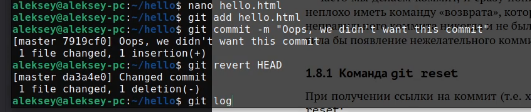
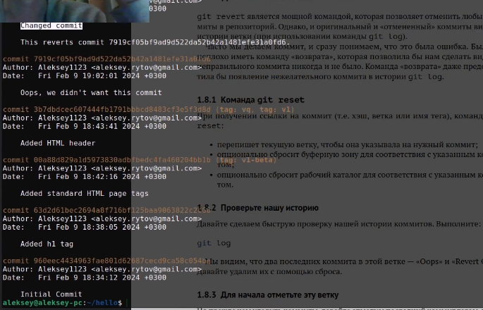
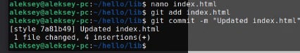
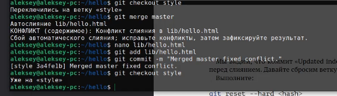
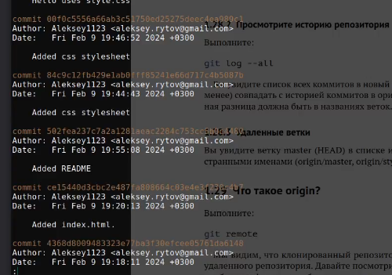

---
## Front matter
title: "Лабораторная работа №1"
subtitle: "Git"
author: "Рытов Алексей Константинович"
lang: ru-RU

## Bibliography
bibliography: bib/cite.bib
csl: pandoc/csl/gost-r-7-0-5-2008-numeric.csl

## Pdf output format
toc-depth: 2
lof: true # List of figures
fontsize: 12pt
linestretch: 1.5
papersize: a4
documentclass: scrreprt
## I18n polyglossia
polyglossia-lang:
  name: russian
  options:
	- spelling=modern
	- babelshorthands=true
polyglossia-otherlangs:
  name: english
## I18n babel
babel-lang: russian
babel-otherlangs: english
## Fonts
mainfont: PT Serif
romanfont: PT Serif
sansfont: PT Sans
monofont: PT Mono
mainfontoptions: Ligatures=TeX
romanfontoptions: Ligatures=TeX
sansfontoptions: Ligatures=TeX,Scale=MatchLowercase
monofontoptions: Scale=MatchLowercase,Scale=0.9
## Biblatex
biblatex: true
biblio-style: "gost-numeric"
biblatexoptions:
  - parentracker=true
  - backend=biber
  - hyperref=auto
  - language=auto
  - autolang=other*
  - citestyle=gost-numeric
## Pandoc-crossref LaTeX customization
figureTitle: "Рис."
tableTitle: "Таблица"
listingTitle: "Листинг"
lofTitle: "Список иллюстраций"
lotTitle: "Список таблиц"
lolTitle: "Листинги"
## Misc options
indent: true
header-includes:
  - \usepackage{indentfirst}
  - \usepackage{float} # keep figures where there are in the text
  - \floatplacement{figure}{H} # keep figures where there are in the text
---

# **Цель работы**

– Изучить идеологию и применение средств контроля версий.
– Освоить умения по работе с git.

---

# Выполнение лабораторной работы

1. Натсройка core.autocrlf (рис. 1) 

    

---

2. Создание страницы Hello World (рис. 2)

    

Создание репозитория, добавление файла, проверка состояния (рис. 3, 4).

   

   

---
3. Изменение страницы Hello World (рис. 5).

4. Индексация изменений, и их коммит (рис. 5).

Добавление тэгов и их индексация (рис. 6).
    

Коммит индексации. (рис. 7).
    

Просмотр истории (рис. 8).
    

Получаем старые версии (рис. 9).
    

Возвращаемся в HEAD (рис. 10).
    

Создание тэгов и переключение по ним (рис. 11 - 13).

---

5. Отмена локальных изменений (рис. 14).
    

6. Отмена проиндексированных изменений (перед коммитом) (рис. 15).

7. Отмена коммитов (рис. 16).

Log (рис. 17)

8. Удаление коммиттов из ветки (рис. 18 - 19).

9. Удаление тега oops (рис. 20).

10. Внесение изменений в коммиты (рис. 21 - 22).

11. Перемещение файлов (рис. 23).

13. Добавление index.html (рис. 24).

14. .git каталог и базы данных объектов (рис. 25).

15. Работа непосредственно с объектами git (рис. 26 - 27).

16. Создание ветки (рис. 28 - 30).

17. Навигация по веткам Создание ветки (рис. 31 - 32).

18. Изменения в ветке master (рис. 33).
    
19. README.md (рис. 34 - 35).
    
    
20. Merge (рис. 36).
    
21. Создание конфликта (рис. 37).
    
22. Разрешение конфликтов (рис. 38).
    
23. Сброс ветки style (рис. 39 - 40).
    
    

24. Сброс ветки master (рис. 41).
    

25. Rebase (рис. 42).

26. Слияние в ветку master (рис. 43).
    
27. Клонирование репозиториев (рис. 44).

28. Просмотр клонированного репозитория (рис. 45).
    
29. Origin (рис. 46).
    
30. Удаление ветки (рис. 47).
    
31. Изменение оригинального репозитория (рис. 48).

32. Слияние извлеченных изменений (рис. 49).
    

33. Добавление ветки наблюдения (рис. 50).

35. Чистый репозиторий (рис. 51).

36. Добавление удаленного репозитория (рис. 52).

37. Отправка изменений (рис. 53).

38. Извлечение общих изменений (рис. 54).

---

# Вывод

Мы изучили идеологию и применение средств контроля версий, а также освоили умения по работе с git. 

---